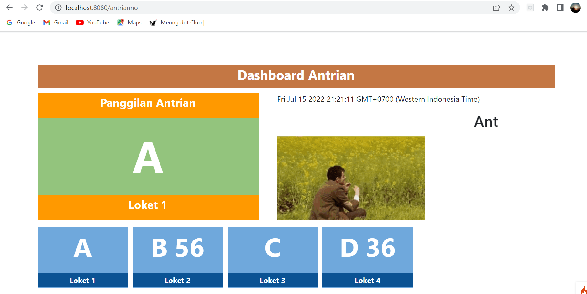

# **UAS PEMROGRAMAN WEB** 

**Nama              : Ainul yaqin**  
**NIM               : 312010423**  
**Kelas             : TI.20.A.1**  
**Mata Kuliah       :Pemrograman Web**  

**LANGKAH PERTAMA** 
Baik sekarang saya akan membuat sebuah website sederhana yakni antrian loket,  
pertama kita instal terlebih dahulu CodeIgniter untuk kerangka PHP agar dapat membangun situs websitenya. 
 
lalu kita buka XAMPP dan kita aktifkan Apache dan MySQL 
 

**LANGKAH KEDUA** 
Kita buat database di"PHPMyadmin" seperti gambar berikut; 
 
lalu kita cari dan buka berkas *"Ci4"* pada Visual Studio Code, berikut juga kita coding didalamnya, dan Export Database *SQLnya* ke dalam berkas Ci4 
 
 

**LANGKAH KETIGA** 
ketika kerangka website telah jadi diberkas Ci4 yang kita buat di Visual Studio Code, berikutnya kita buka *"shell"* dan kita ketik perintah sebagai berikut; 
 
ketika perintah berasil, kalian salin *URLnya* dibagian teks berwarna hijau lalu buka browser dan tempel URL yang telah disalin seperti gambar berikut: 
 

**LANGKAH TERAKHIR** 
langkah terakhir kita cek masing masing menu sudah berjalan atau tidak, jika sudah maka akan tampil sebagai berikut;  
*"Menu Antrian"* 
 

*"Layanan Antrian"* 
 

*"Loket Panggil"* 
 

*"Loket Pelayanan"* 
 

Berikut hasil project nya   
[**Klik link**](http://localhost:8080/)

Berikut merupakan video penjelasan nya  
[**Klik link**]()